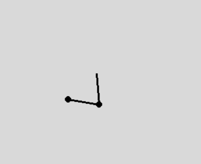

    

# Double Pendulum

The set of coupled non-linear differential equations governing the motion of the [double pendulum](https://en.wikipedia.org/wiki/Double_pendulum) are given by:

$$
\begin{aligned}
m_1 l_1^2 \ddot{\theta}_1 + m_2 l_1 l_2 \ddot{\theta}_2 \cos(\theta_1 - \theta_2) 
+ m_2 l_1 l_2 \dot{\theta}_2^2 \sin(\theta_1 - \theta_2) + (m_1 + m_2) g l_1 \sin(\theta_1) &= 0 \\
m_2 l_2^2 \ddot{\theta}_2 + m_2 l_1 l_2 \ddot{\theta}_1 \cos(\theta_1 - \theta_2) 
- m_2 l_1 l_2 \dot{\theta}_1^2 \sin(\theta_1 - \theta_2) + m_2 g l_2 \sin(\theta_2) &= 0
\end{aligned}
$$

This numerical simulation was made using Python and visualized using Pygame.