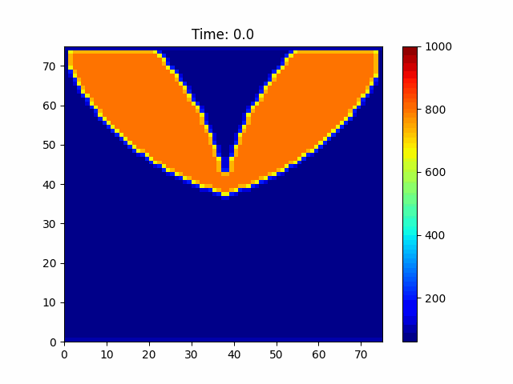

# Heat Equation in Two Dimensions

The heat equation is a fundamental partial differential equation that describes the distribution of heat in a given region over time. It is given by:

$$
\frac{\partial u}{\partial t} = \alpha \left( \frac{\partial^2 u}{\partial x^2} + \frac{\partial^2 u}{\partial y^2} \right)
$$

where:
- $( u )$ is the temperature field,
- $( t )$ is time,
- $( x )$ and $( y )$ are the spatial coordinates,
- $( \alpha )$ is the thermal diffusivity.

## Numerical Solution
Presented is a numerical solution to the heat equation with insulated boundary conditions, and a heart-shaped initial temperature distribution. The solution was computed using a finite difference method with a forward-time central-space discretization scheme.

The heat can be seen diffusing from the center of the heart shape outwards, with the temperature decreasing over time. 
