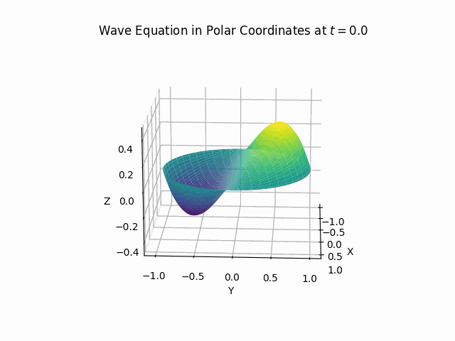

    

# Wave Equation in Polar Coordinates

The wave equation in polar coordinates is given by:

$$
\frac{\partial^2 u}{\partial t^2} = c^2 \left( \frac{\partial^2 u}{\partial r^2} + \frac{1}{r} \frac{\partial u}{\partial r} + \frac{1}{r^2} \frac{\partial^2 u}{\partial \theta^2} \right)
$$

