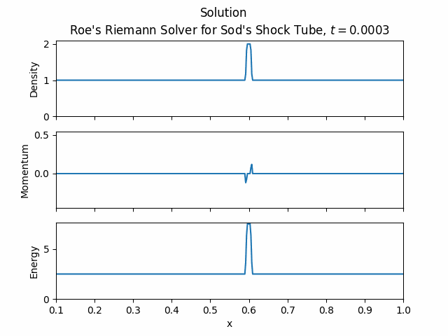

    

# Finite Volume: Euler Equations

[Euler equations](https://en.wikipedia.org/wiki/Euler_equations_(fluid_dynamics)) are a set of [hyperbolic partial differential equations](https://en.wikipedia.org/wiki/Hyperbolic_partial_differential_equation) that describe the motion of an inviscid fluid. The compressible equations are given by:
$$
\\
\begin{align*}
\rho_t + (\rho u)_x  = 0 \\
(\rho u)_t + \left( \rho u^2 + p \right)_x = 0 \\
E_t + \left( (E + p)u \right)_x = 0
\end{align*}\\
$$
Where:
- $\rho$ is the density of the fluid
- $u$ is the velocity of the fluid
- $p$ is the pressure of the fluid
- $E$ is the total energy of the fluid
- $P$ is the pressure of the fluid, related to the density and internal energy by an equation of state. For example, for polytropic gases, the equation of state is given by:
$$
P = (\gamma - 1) (E - \frac{1}{2} \rho u^2)
$$

- $\gamma$ is the ratio of specific heats, which is a constant for a given gas. For air, $\gamma \approx 1.4$.

## Numerical Solution
I use a [Godunov finite volume method](https://en.wikipedia.org/wiki/Godunov%27s_scheme) to solve the Euler equations. The method is based on the idea of partitioning the domain into a grid of cells where each cell has a constant value. The fluxes at the boundaries of each cell are found from the solution to the [Riemann problem](https://en.wikipedia.org/wiki/Riemann_problem) that cooresponds with the cell interface.

For the Riemann solver, I used the method of Roe. The Roe solver is based on a [linearization](https://en.wikipedia.org/wiki/Linearization) of the the equations around a "Roe average" of the two constant states.

The initial condition is a [shock tube problem](https://en.wikipedia.org/wiki/Sod_shock_tube), where the initial condition is given by:
$$
\begin{align*}
\rho(x,0) = \begin{cases} 1 & x < 0 \\ 0.125 & x > 0 \end{cases} \\
u(x,0) = \begin{cases} 0 & x < 0 \\ 0 & x > 0 \end{cases} \\
p(x,0) = \begin{cases} 1 & x < 0 \\ 0.1 & x > 0 \end{cases}
\end{align*}
$$

The Exact solution of the Riemann problem for Euler equations is known, so that can be used to test the accuracy of the method. Below, The finite volume solution is compared with a popular finite difference solution, and the exact solution to the Riemman problem. The exact solution is given by the dashed line, and the finite volume solution is given by the dotted line, and the finite difference solution is given by the solid line.

It can be seen that the finite volume approach does a better job of capturing the shock than the finite difference approach. The finite difference solutions are more diffusive, and do not capture the shock as well.

<!--  -->

## Two Dimensional Euler Equations

Subsonic initial condition
$$
\\
\rho_0 = \begin{cases} 1.5 & 0.35 < y < 0.55 \ \text{and} \ x < 0.1 \\ 0.4 & \text{otherwise} \end{cases} \\
u_0 = \begin{cases} 0.5 & 0.35 < y < 0.55 \ \text{and} \ x < 0.1 \\ 0 & \text{otherwise} \end{cases} \\
v_0 = 0 \\
P_0 = \begin{cases} 1.5 & 0.35 < y < 0.55 \ \text{and} \ x < 0.1 \\ 0.4 & \text{otherwise} \end{cases} \\
$$

Supersonic initial condition
Same as above, but with $u_0 = 3$ (roughly mach 2.5 for this flow).

## Future Work

There are certain scenarios where unphysical oscillations develop. I am currently working to mitigate this issue. Due to the nature of the linearized Riemann solver, the method fails in the presence of a vacuum. I am working to implement a fix, or to use a different Riemann solver. I am also currently working on implementing the two-dimensional case on an [unstructured grid](https://en.wikipedia.org/wiki/Unstructured_grid).

### References

[Numerical Methods for Conservation Laws](https://link.springer.com/book/10.1007/978-3-0348-8629-1) by Randall J. LeVeque

[Riemann Solvers and Numerical Methods for Fluid Dynamics](https://link.springer.com/book/10.1007/b79761) by E. F. Toro
